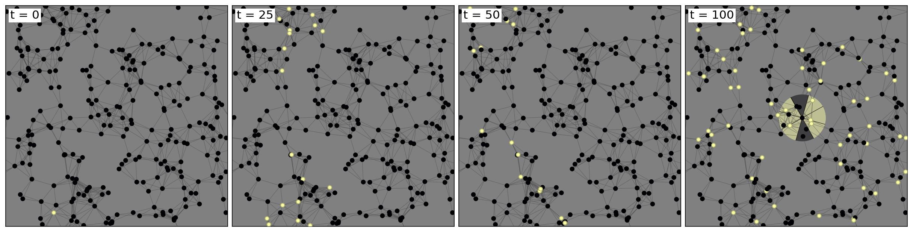

# Emergent Macro-Criticality from Micro-Critical Agents

<p align="center">
  
</p>

This repository contains the code and artifacts for the paper **"Emergent Macro-Criticality from Micro-Critical Agents"**.

The project studies how micro-level reservoir dynamics in agents relate to macro-level collective criticality (avalanche statistics, connectivity effects, sensing constraints, etc.).

## Repository organization

- `src/reservoir_beggs.py`: stochastic recurrent reservoir model (micro dynamics).
- `src/env_collective.py`: multi-agent environment and sensing/interaction rules.
- `src/run_base.py`: shared rollout logic connecting reservoirs and the environment.
- `src/run_isolated.py`: isolated reservoir experiments and metric data generation.
- `src/run_collective.py`: collective multi-agent experiments and avalanche/power-law analysis.
- `src/metrics.py`: avalanche extraction and power-law fitting helpers.
- `src/plots/`: plotting scripts for isolated, collective, vision-radius, and sensor analyses.
- `experiments_data/`: generated simulation outputs (`.npz`, CSV summaries).
- `media/`: generated figures used for analysis and paper visuals.

## Quick start

This project is configured with `pyproject.toml` and works well with `uv`.

```bash
# from repository root
uv sync
```

If you do not use `uv`, install the dependencies listed in `pyproject.toml` with your preferred environment manager.

## How to run

### 1) Isolated (micro-level) experiments

Generate isolated metrics data:

```bash
uv run python src/run_isolated.py
```

Generate isolated plots:

```bash
uv run python src/plots/plot_isolated.py
```

### 2) Collective (micro->macro) experiments
See **Notes** below before running long collective experiments.
`src/run_collective.py` contains the main pipelines:
- `experiment_vision_radius()`
- `experiment_number_sensors()`

Run one directly from the command line:

```bash
uv run python -c "from src.run_collective import experiment_vision_radius; experiment_vision_radius()"
```

or

```bash
uv run python -c "from src.run_collective import experiment_number_sensors; experiment_number_sensors()"
```

These pipelines generate state files, extract avalanches, and fit power laws into `experiments_data/...`.

### 3) Plot collective results

```bash
uv run python src/plots/plot_vision_radius_results.py
uv run python src/plots/plot_number_sensors_results.py
uv run python src/plots/plot_connectivity_vr.py
uv run python src/plots/plot_macro_cascade.py
```

Figures are written to `media/...`.

## Notes

- Some experiment settings in `src/run_collective.py` are intentionally large and can take a long time to complete.
- GPU is used automatically when available in several scripts (`torch.cuda.is_available()` checks).
- Generated data artifacts (`.npz`) are ignored by git as configured in `.gitignore`.
- The digested experiment results are already included in the CSV files currently in this project, so you typically do **not** need to rerun the long `.npz` experiment pipelines unless you want to regenerate or extend the dataset.
